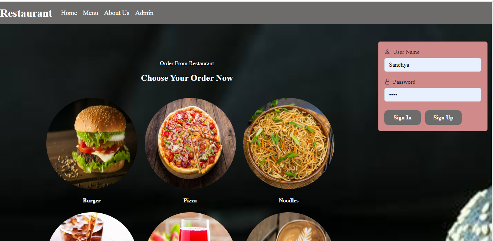

# Restaurant

# project-documentation
<p align="center">
  <a href="" rel="noopener">
 </a>
</p>

<h3 align="center">Restaurant</h3>

<p align="center">This project is a web dynamic java project made using jsp servlet. It is connected with mysql-connector java, jsp api, jstl, java-servlet api. The webpages are made as jsp files and it is running on tomcat server 9.
    <br> 
</p>

## 📝 Table of Contents
- [About](#about)
- [Getting Started](#getting_started)
- [Deployment](#deployment)
- [Project View](#projectView)
- [Usage](#usage)
- [Flow Chart](#flowchart)
- [TODO](../TODO.md)
- [Contributing](../CONTRIBUTING.md)
- [Authors](#authors)
- [Acknowledgments](#acknowledgement)

## 🧐 About <a name = "about"></a>
Fully Functional E-commerce Restaurant is a responsive online restaurant website. The technologies used in this project are java, jsp, HTML, CSS, OOPs and mysql. There are a few important modules in the project like home page, image gallery, product listing page, about page, cart page, admin page etc. The data is accessed using mysql call and then rendered into the webpage using dynamic html template created using string literals. For cart-page we are using localstorage to temporarily storing data before clicking on the checkout button. I took almost 40 - 50 hrs to complete this project. SkillLync helped me by providing the wire-frames for all relevant feature pages.

## 🏁 Getting Started <a name = "getting_started"></a>
These instructions will get you a copy of the project up and running on your local machine for development and testing purposes. See [deployment](#deployment) for notes on how to deploy the project on a live system.

### Prerequisites
What things you need to install the software and how to install them.

```
Eclipse for Java EE
MySQL Command Line
```

### Installing
A step by step series of examples that how to get a development env running.

Steps to Install Eclipse for Java

```
Download adn install eclipse from eclipse.org
Change the perspective of Eclipse from JAVA to JAVA EE
```

Steps to Install MySQL Command Line

```
Download adn install mysql from mysql.com
Open and type the default password "root"
```

## 🎈 Project View <a name="projectView"></a>
### Login Page
<!--  -->


### User Login *User*
<!--  -->


### Cart *User Feature*
<!--  -->


### Checkout *Admin Feature*
<!--  -->


### Edit Dish *Admin Feature* (GIF)
<!--  -->


## 🔧 Running the tests <a name = "tests"></a>
Run this program using tomcat server 9 in java eclipse. Run as 'run on server'.

### Break down into end to end tests
There might be a scenario when the project will give an error, in that case u need to create database in mySQL command line.
The commands are here

Create the database first-
```
create database restaurantDb;
  use restaurantDb;
```

create table members for signup-
```
CREATE TABLE members (
       first_name VARCHAR(45) NOT NULL,
       last_name VARCHAR(45) NOT NULL,
       email VARCHAR(45) NOT NULL,
       uname VARCHAR(45) NOT NULL,
       password VARCHAR(45) NOT NULL,
       PRIMARY KEY (uname));
```

create table items to add menu-
```
CREATE TABLE items (
       id INT NOT NULL,
       item_name VARCHAR(45) NOT NULL,
       price_rupee INT NOT NULL,
       PRIMARY KEY (id));
```

## 🎈 Usage <a name="usage"></a>
Open the system, it has very friendly user interface. It shows project explorer at left, where all our projects will be shown. we can import projects from github by file> import> java project.


## ✍️ Authors <a name = "authors"></a>
- [@Sandhya](https://github.com/sandhya12r) - FSD

See also the list of [contributors](https://github.com/sandhya12r/Restaurant/contributors) who participated in this project.

## 🎉 Acknowledgements <a name = "acknowledgement"></a>
- SkillLync
- [YouTube](https://www.youtube.com/watch?v=Ftytq7XF_Ec&t=1309s)
